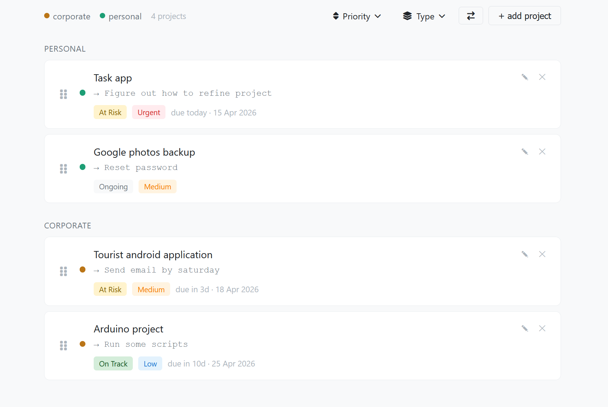
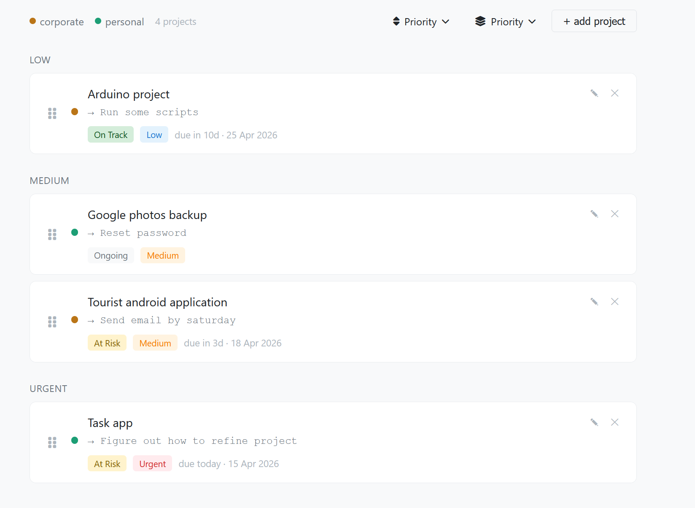
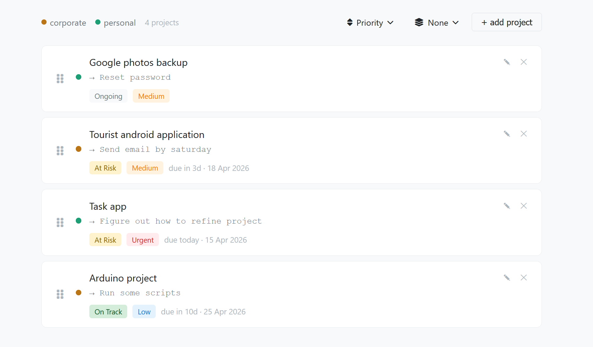

# Project Tracker

A Django-based project tracker application for managing personal and corporate projects with tasks.

> ### NOTICE! This is a vibe-coded project created with SWE-1.6 from Cognition and Gemini from Google.
> 
> You are free to contribute to this project, fork and use for personal or commercial purposes.

## UI





## Installation

1. Clone the repository:
   ```bash
   git clone https://github.com/Emi7i/Project-tracker
   cd "Task App"
   
2. Create a virtual environment:
   ```bash
   python -m venv .venv
   ```
   and use it:
   ```bash
   .venv\Scripts\activate  # Windows
   # or
   source .venv/bin/activate  # Linux/Mac
   ```

3. Install dependencies:
   ```bash
   pip install -r requirements.txt
   ```

4. Run migrations:
   ```bash
   python manage.py makemigrations
   python manage.py migrate
   ```

5. Create a superuser (optional, for admin access):
   ```bash
   python manage.py createsuperuser
   ```

6. Run the development server:
   ```bash
   python manage.py runserver
   ```

7. Open your browser and navigate to `http://127.0.0.1:8000/`

## Usage
```
-> Click `+ add project` button to create a new project
-> Input a name, select a type, and a due date
-> You can also add what is the next task you need to do in this project

-> Click the edit (✎) button to modify a project
-> Click the remove (✕) button to delete a project
-> Drag and drop projects to reorder them
-> Use the sort dropdown to sort by custom order, status, or priority
-> Use the group dropdown to group projects by status, priority, or type
```
## Admin Interface

Access the Django admin interface at `http://127.0.0.1:8000/admin/` to manage projects through the admin panel.
> Note:  You need to create a superuser account first by running:
> ```bash
> python manage.py createsuperuser
> ```